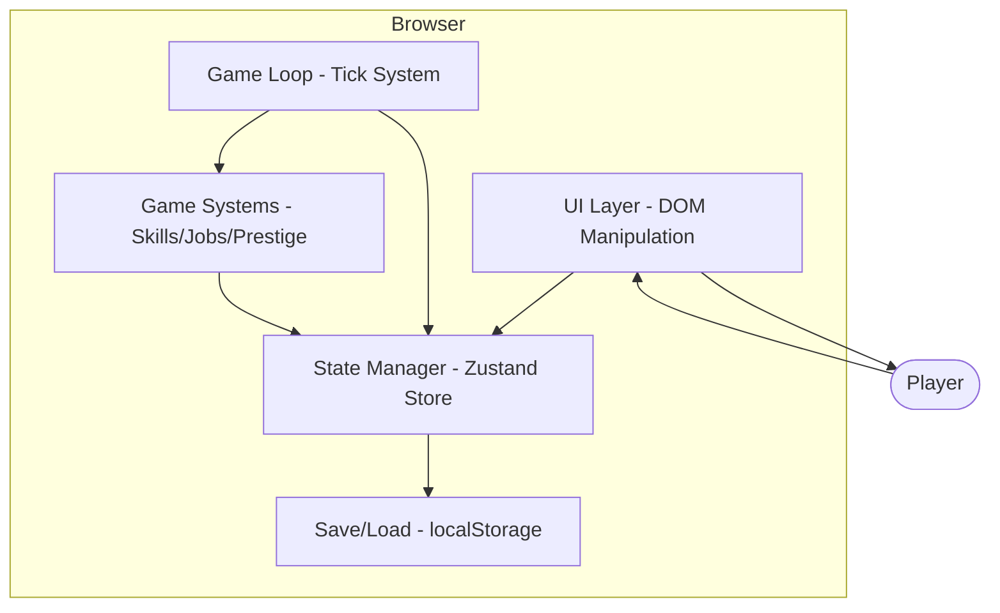

# Architecture Overview - The Amulet

## System Type
Browser-based idle RPG. Single-page application, no backend required.
All state managed client-side with localStorage persistence.

## High-Level Architecture

## Container Overview

| Container | Technology | Responsibility | Key Files |
|-----------|------------|----------------|-----------|
| Game Loop | TypeScript | Tick processing, time conversion | `src/core/game-loop.ts` |
| State | Zustand | Centralized game state | `src/state/` |
| Systems | TypeScript | Game logic (skills, jobs, etc.) | `src/systems/` |
| UI | Vanilla TS + DOM | Rendering, user input | `src/ui/` |
| Data | TypeScript + Zod | Game content definitions | `src/data/` |

## Data Flow

1. Real time passes -> Game Loop converts to day ticks
2. Ticks dispatched to active systems (skills, jobs)
3. Systems compute new state -> update Zustand store
4. UI subscribes to store changes -> re-renders
5. Periodic auto-save to localStorage

## Key Design Decisions

- **Data-Driven**: All game content (skills, jobs, locations) defined as data objects in `src/data/`, validated by Zod schemas in `specs/schemas/`
- **Spec-First**: Features defined in Gherkin before implementation
- **Type-Safe**: All types derived from Zod schemas, never hand-written
- **Deterministic**: Game logic is pure functions for testability and replay

## Related ADRs

See [ADR Index](../adr/README.md)
